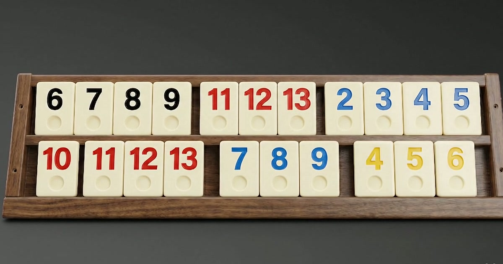

# DizGitsin — 101 Okey Asistanı Landing Page

<p align="center">
  
</p>

<p align="center">
  <a href="https://play.google.com/store/apps/details?id=com.ozkanilkay.dizgitsin">
    
  </a>
  
  
  
</p>

---

**DizGitsin**, 101 Okey oyuncuları için geliştirilmiş mobil asistan uygulamasının tanıtım sayfasıdır. Oyundaki taşların ahşap ıstakaya düştüğü sinematik bir scroll animasyonu, glassmorphism kart tasarımı ve premium estetikle uygulamayı tanıtır.

> Geliştirici: **İlkay Özkan** — Android uygulaması  
> Web Tasarım: **Sıla Karahan** — Bu landing page

---

## Özellikler

- **Scroll-Bound Canvas Animasyonu** — 160 yüksek kaliteli JPG frame'den oluşan okey taşı sekansı, scroll pozisyonuyla tam senkron oynar (GSAP ScrollTrigger + scrub)
- **4 Sütunlu Özellik Grid'i** — Uygulamanın 4 temel özelliği eşit boyutlu glassmorphism kartlarda sunulur
- **Ekranlar Galerisi** — Uygulamanın 4 farklı ekran görüntüsü (Ana Ekran, Okey Analizörü, Yazboz, Strateji Analizi) telefon çerçevesi içinde gösterilir
- **Dinamik Smooth Scroll** — Lenis + GSAP entegrasyonu; yukarı/aşağı scroll için mesafeye orantılı, ayrı hız formülleri
- **Sinematik Navbar** — Hero üzerinde şeffaf, scroll ile koyu yüzeye geçiş, mobil drawer menü
- **Ekibimiz Bölümü** — Geliştirici ve tasarımcı bilgileri, sağ alt köşede rol rozetleri, LinkedIn linkleri
- **Footer CTA** — Google Play indirme butonu, hukuki linkler (Gizlilik / KVKK / Kullanım Koşulları), iletişim
- **Erişilebilirlik** — WCAG AA kontrast, `prefers-reduced-motion`, `aria-label`, skip link, semantic HTML
- **OG / Twitter Kartı** — 1200×630 open graph image, canonical URL, yapılandırılmış metadata

---

## Teknoloji Yığını

| Katman | Teknoloji |
|---|---|
| Framework | Next.js 14 (App Router) |
| Animasyon | GSAP 3 + ScrollTrigger |
| Smooth Scroll | Lenis |
| Stil | Tailwind CSS 3.4 |
| İkonlar | Lucide React |
| Font | Playfair Display · Bricolage Grotesque · Plus Jakarta Sans · JetBrains Mono |
| Canvas | Web Canvas API (160 frame JPG sekansı) |
| Dil | TypeScript |

---

## Kurulum

```bash
# Bağımlılıkları yükle
npm install

# Geliştirme sunucusu
npm run dev
# → http://localhost:3000

# Production build
npm run build
npm start
```

---

## Proje Yapısı

```
src/
├── app/
│   ├── layout.tsx          # Font yükleme, metadata, viewport
│   ├── page.tsx            # Section sıralaması
│   └── globals.css         # CSS değişkenleri, Tailwind katmanları
│
├── components/
│   ├── SmoothScroll.tsx    # Lenis + GSAP ticker + hash-link handler
│   ├── Navbar.tsx          # Sticky header, mobile drawer
│   ├── ui/
│   │   ├── DownloadButton.tsx   # Google Play CTA
│   │   ├── FeatureCard.tsx      # Glass özellik kartı
│   │   ├── TileIcon.tsx         # Okey taşı SVG ikonu
│   │   └── ScrollHint.tsx       # Hero alt "kaydır" göstergesi
│   └── sections/
│       ├── Hero.tsx        # Sticky canvas + başlık overlay
│       ├── Features.tsx    # 4 sütunlu özellik grid'i
│       ├── Screenshots.tsx # Telefon çerçeveli uygulama ekranları
│       ├── About.tsx       # Ekip kartları
│       └── Footer.tsx      # CTA + linkler
│
├── hooks/
│   ├── useMediaQuery.ts       # Responsive breakpoint hook
│   └── useScrollSequence.ts   # Canvas preload + ScrollTrigger
│
└── lib/
    ├── frames.ts           # Frame URL üretici, mobil/desktop ayrımı
    └── gsap-setup.ts       # GSAP plugin kayıt

public/
├── frames/                 # frame-001.jpg … frame-160.jpg
├── videos/                 # tiles-falling.mp4 (frame kaynağı)
├── images/                 # Logo, ekran görüntüleri
└── og-image.jpg            # 1200×630 Open Graph görseli
```

---

## Mobil Optimizasyon

- Mobil cihazlarda canvas sekansı 80 frame'e düşürülür (her 2. frame seçilir — %50 daha az network)
- DPR (device pixel ratio) 5× üst sınır — retina/4K ekranlarda native yoğunluk, daha yüksek alt kademelerde performans korunur
- `scrub: 0.3` (mobil) vs `0.5` (masaüstü) — daha hızlı tepki
- Hero scroll yüksekliği: 320vh (mobil) / 380vh (masaüstü)

---

## Renk Paleti (Dark Theme)

```
ink-900    #13110F   ← Sayfa arka planı (sıcak siyaha yakın)
ink-800    #1C1916   ← Navbar / footer yüzey
ink-700    #26221D   ← Kart arka planı
ink-500    #3A332B   ← Border / divider

tile-cream #F5EFE4   ← Birincil metin (sıcak fildişi)
wood-600   #B8AE9E   ← İkincil metin
wood-500   #7C7468   ← Üçüncül / eyebrow

gold       #E0B65C   ← Birincil aksan (CTA, vurgu)
tile-red   #C0392B   ← Okey kırmızısı (özellik ikonu)
tile-blue  #2E5C8A   ← Okey mavisi (özellik ikonu)
```

---

## Frame Üretimi

Hero animasyonu için frame'ler `public/videos/tiles-falling.mp4`'ten ffmpeg ile çıkarılır:

```bash
ffmpeg -i public/videos/tiles-falling.mp4 \
  -vf "fps=20" -frames:v 160 -q:v 2 -start_number 1 \
  public/frames/frame-%03d.jpg
```

- **160 frame** × **20 fps** = 8 saniyelik kaynak video
- **1280×720** çözünürlük, JPG quality 2 (en yüksek)

Frame sayısı veya format değişirse `src/lib/frames.ts` içindeki `TOTAL_FRAMES` ve `frameUrl()` güncellenmelidir.

---

## Lisans

Bu repo bir portfolyo / tanıtım projesidir. Ticari kullanım için izin alınız.

---

<p align="center">Made with care in İstanbul &nbsp;·&nbsp; Web design by <strong>Sıla Karahan</strong></p>
